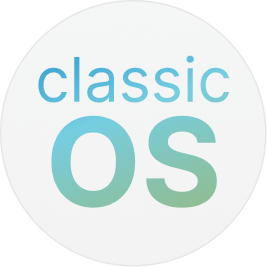
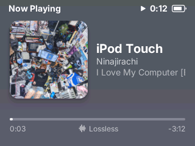
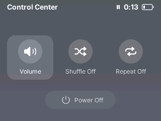
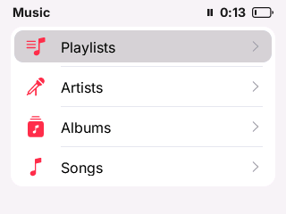

<p align="center">
  
</p>

<h1 align="center">classicOS</h1>

<p align="center">
  <a href="host/rust/Cargo.toml"></a>
  <a href="package.json"></a>
  <a href="#build"></a>
  <a href="#license"></a>
</p>

<p align="center">
  classicOS is custom firmware for iPod based on Rockbox.<br>
  A fresh interface inspired by modern iOS.
</p>

<p align="center">
  Tested on iPod Video (5G). Support for other models is unverified.
</p>

<p align="center">
  
  
  
</p>

<p align="center">
  <a href="#build">Build</a> ·
  <a href="#install-on-ipod">Install</a> ·
  <a href="#development">Development</a> ·
  <a href="#license">License</a>
</p>

## Compatibility

classicOS is currently tested on the **iPod Video (5G)**. Other iPod models
are untested, and the build commands below target the iPod Video.

## Build

The current build and deployment workflow is developed on macOS.

| Dependency | Used for |
| --- | --- |
| Bun | Package management, UI compilation, and project commands |
| SDL2 | Desktop simulator |
| Rust stable | Simulator runtime |
| Rust `nightly-2026-07-01` with `rust-src` | iPod runtime |
| Rockbox ARM toolchain | Native firmware; place in `~/rbdev/bin` or on `PATH` |

From the repository root:

```sh
bun install --frozen-lockfile
```

### Try the simulator

```sh
bun run sim
```

This builds and launches the simulator. Add music to `out/sim/simdisk/`.

| Key | Action |
| --- | --- |
| Up / Down | Move focus with the wheel |
| Enter | Select |
| Esc | Menu / Back |
| Space | Play / Pause |
| Left / Right | Previous / Next track |
| H | Toggle hold |
| F5 | Save a screenshot |

To build without launching, use `bun run build:sim`.

### Build for iPod

```sh
bun run build:ipod
```

The firmware image is written to `out/ipod/rockbox.ipod`.

## Install on iPod

Follow [Rockbox’s installation guide](https://www.rockbox.org/wiki/RockboxUtility)
to install the bootloader for your iPod model. Once installed, mount your iPod
in disk mode and pass its volume path:

```sh
bun run deploy /Volumes/CLASSICOS
```

Replace `/Volumes/CLASSICOS` with your iPod's mount point. Deployment copies
the firmware, matching codecs, shell assets, and library configuration. It
preserves the first firmware/codecs backup, verifies the firmware copy, and
ejects the volume. The bootloader and original firmware remain unchanged.

## Development

Run the model, renderer, and runtime checks:

```sh
bun run typecheck
bun run test
```

Pass Make variables through the build commands:

```sh
bun run build:ipod PJS_HUD=1
bun run build:sim PJS_APP=ipod-video-demo
```

## Modules

| Directory | Responsibility |
| --- | --- |
| `shell/` | Screens, model, icons |
| `runtime/` | UI engine, compiler, and framework powered by PocketJS |
| `host/` | Boot, input, playback/library services, and native integration |
| `system/` | Kernel, drivers, filesystem, codecs, and playback |
| `scripts/` | Build, simulate, deploy |
| `tests/` | Model and renderer checks |
| `docs/` | Architecture and development documentation |
| `out/` | Generated build output |

The shell runs on the runtime, while the host connects it to the system's
hardware and music services. Everything builds into one firmware image.

The build script creates ignored links under `system/apps/classicos/` so
system build rules can find host sources. Edit the maintained files in
`host/`. Build output and simulator data live in `out/`.

## Contributing

See the [contribution guide](CONTRIBUTING.md) for issues, pull requests,
validation, and AI-assisted contributions. Hardware test reports for other
iPod models are welcome.

## License

New classicOS code is licensed under GPL-2.0-or-later. The combined firmware
is distributed under the applicable GNU GPL terms.

PocketJS-derived runtime code retains its MIT license; see
[runtime/LICENSE](runtime/LICENSE). Existing third-party components retain
their original licenses and copyright notices.
